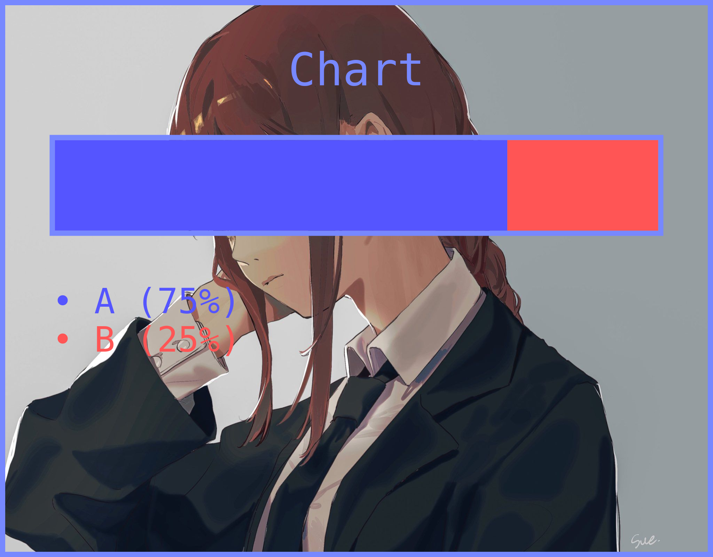

## single-bar-chart v2.0.2

This project can help you in making single bar chart.

### Installing

```bash
npm install Zhiro990/single-bar-chart
```

### Importing

```js
const Chart = require("single-bar-chart");
```

### Usage

```js
let chart = new Chart();
```

#### chart.setTitle(title)

| Parameter | Description | Type | Optional | Default | Example |
| :-: | :-: | :-: | :-: | :-: | :-: |
| `title` | The chart title. | `string` | ❌ | None | `"Most Used Languages"` |

#### chart.setBackground(path_or_buffer)

| Parameter | Description | Type | Optional | Default | Example |
| :-: | :-: | :-: | :-: | :-: | :-: |
| `path_or_buffer` | The image path or buffer. | `string` or `buffer` | ❌ | None | `"./background.jpeg"` |

#### chart.setTheme(backgroundcolor, bordercolor, titlecolor)

| Parameter | Description | Type | Optional | Default | Example |
| :-: | :-: | :-: | :-: | :-: | :-: |
| `backgroundcolor` | The hex color of the background. (Note: Will not be displayed if you use `setBackground()`.) | `string` | ✅ | `"#000000"` | `"#252525"` |
| `bordercolor` | The hex color of the border. | `string` | ✅ | Transparent | `"#7788FF"` |
| `titlecolor` | The hex color of the title. | `string` | ✅ | `"#FFFFFF"` | `"#7788FF"` |

#### chart.addData(name, percentage, hexcolor)

| Parameter | Description | Type | Optional | Default | Example |
| :-: | :-: | :-: | :-: | :-: | :-: |
| `name` | The data name. (Note: The maximum number of characters is 22.) | `string` | ❌ | None | `"JavaScript"` |
| `percentage` | The data percentage. (Note: Can't be more than 100.) | `number` | ❌ | None | `75` |
| `hexcolor` | The data hex color. (Note: This color will be displayed on the bar chart.) | `string` | ✅ | Random | `"#00FF00"` |

> *Note: The maximum amount of data is only 6.*

### Convert The Chart To A Image Buffer
```js
let image = await Chart.createChart(chart);
```

### Example

```js
const Chart = require("single-bar-chart");
const fs = require("fs/promises");

(async () => {
	
	let chart = new Chart()
		.setTitle("Chart")
		.setBackground("./makima.jpeg")
		.setTheme("#FFFFFF", "#7788FF", "#7788FF")
		.addData("A", 75, "#5555FF")
		.addData("B", 25, "#FF5555");
	
	let res = await Chart.createChart(chart);
	await writeFile("example.png", res);

})();
```

### Images

#### makima.jpeg


#### example.png

